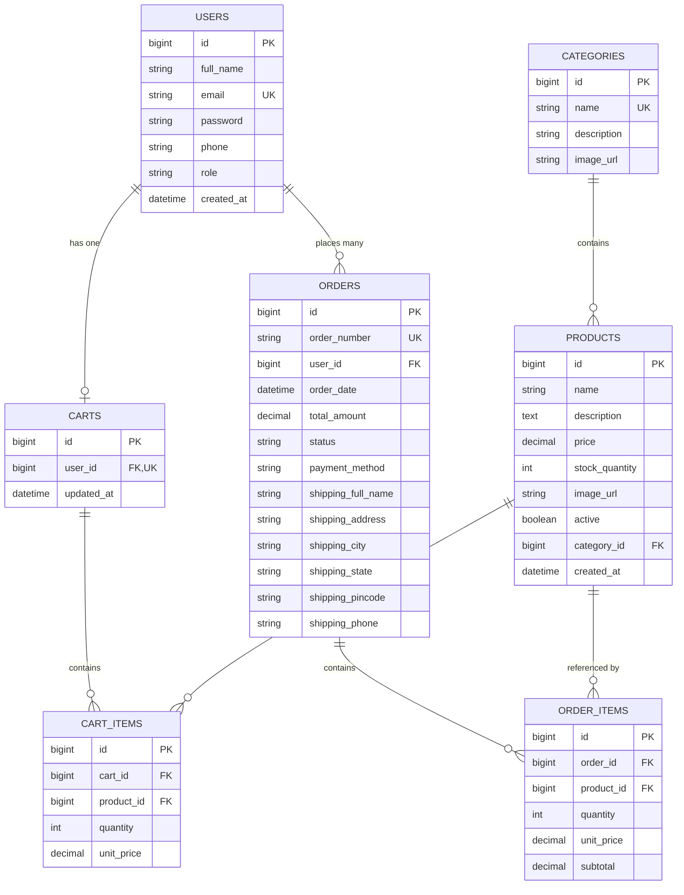

# ShopEase – E-Commerce Web Application

> **Academic Final-Year Capstone Project**  
> A clean, medium-level, and professional full-stack E-Commerce platform built with **Angular 21**, **Spring Boot 3**, **Spring Data JPA**, **Spring Security (JWT)**, and **MySQL 8**.

---

## Table of Contents

1. [Project Overview](#project-overview)
2. [Technology Stack](#technology-stack)
3. [System Architecture](#system-architecture)
4. [Database Design & ER Diagram](#database-design--er-diagram)
5. [Demo Accounts & Credentials](#demo-accounts--credentials)
6. [Quick Start & Setup Guide](#quick-start--setup-guide)
   - [Prerequisites](#prerequisites)
   - [1. Database Configuration (MySQL)](#1-database-configuration-mysql)
   - [2. Backend Setup (Spring Boot)](#2-backend-setup-spring-boot)
   - [3. Frontend Setup (Angular)](#3-frontend-setup-angular)
7. [REST API Documentation](#rest-api-documentation)
8. [QA & Selenium Testability (Stable IDs)](#qa--selenium-testability-stable-ids)

---

## Project Overview

**ShopEase** is designed to demonstrate full-stack software development best practices for technical interviews and academic project defense. It avoids unnecessary complexity (no microservices, Kafka, Redis, or cloud lock-in) while maintaining a strict, industry-standard **Layered Architecture**:

- **Customer Capabilities**: Register, login, browse catalog with categories, search by keyword, sort by price/newest, filter in-stock items, inspect product details with stock limits, manage persistent cart, checkout with delivery address and payment choice (COD / Demo Card), and track order history.
- **Admin Capabilities**: Login, view KPI dashboard (Revenue, Orders, Products, Customers, Pending Orders, Low Stock Alerts), manage products (add, edit, adjust stock, soft-delete), and update customer order fulfillment statuses (`PLACED` &rarr; `PROCESSING` &rarr; `SHIPPED` &rarr; `DELIVERED` &rarr; `CANCELLED`).

---

## Technology Stack

| Layer | Technologies Used |
| :--- | :--- |
| **Frontend** | Angular 21, TypeScript, HTML5, CSS3, Bootstrap 5.3, Bootstrap Icons |
| **Backend** | Java 21, Spring Boot 3.3.4, Spring Web, Spring Data JPA, Spring Validation |
| **Security** | Spring Security 6, JWT (JSON Web Tokens via JJWT 0.12.6), BCrypt Password Hashing |
| **Database** | MySQL 8.0+ (with Hibernate ORM & automatic schema migration) |
| **QA & Automation** | Selenium WebDriver, Python, PyTest, Page Object Model (POM), pytest-html |
| **API & Performance** | Postman, Newman CLI, Apache JMeter |
| **Build Tools** | Maven 3.9+, Node.js 24+, npm 11+ |

---

## System Architecture

```text
┌──────────────────────────────────────────────────────────────┐
│                  Angular 21 Single Page App                  │
│               http://localhost:4200 (Client)                 │
│                                                              │
│  Components & Pages:                                         │
│  ├── Navbar (Brand, Search bar, Cart badge, User dropdown)   │
│  ├── Home (Hero banner, Category grid, Featured products)    │
│  ├── Catalog (Keyword search, Category chips, Price sort)    │
│  ├── Details (Quantity selector, Stock availability check)   │
│  ├── Cart (Real-time subtotal, Quantity +/-, Remove, Clear)  │
│  ├── Checkout (Delivery address form, COD / Demo Card)       │
│  ├── Orders (History list, Status progress timeline)         │
│  └── Admin Portal (Dashboard KPIs, Product CRUD, Order state)│
│                                                              │
│  Core Services:                                              │
│  ├── AuthService (Signals, User state, Token storage)        │
│  ├── CartService (Reactive cartItemCount$ BehaviorSubject)   │
│  ├── ProductService, OrderService, AdminService              │
│  ├── JwtInterceptor (Attaches Authorization: Bearer <token>) │
│  └── Route Guards (authGuard, adminGuard)                    │
└──────────────────────────────┬───────────────────────────────┘
                               │ REST APIs (JSON over HTTP)
                               │ CORS: localhost:4200 allowed
┌──────────────────────────────▼───────────────────────────────┐
│                   Spring Boot 3.x Backend                    │
│                 http://localhost:8080 (API)                  │
│                                                              │
│  [Security Layer]                                            │
│  ├── SecurityConfig, JwtAuthenticationFilter, TokenProvider  │
│                                                              │
│  [Controller Layer]                                          │
│  ├── AuthController, ProductController, CategoryController   │
│  ├── CartController, OrderController, AdminController        │
│                                                              │
│  [Service Layer (Business Logic)]                            │
│  ├── AuthService (BCrypt hashing, JWT generation)            │
│  ├── ProductService (Filters, sorting, inventory adjustment) │
│  ├── CartService (Stock validation, item calculations)       │
│  ├── OrderService (@Transactional stock deduction & cart)    │
│  └── AdminService (Aggregations, order status workflow)      │
│                                                              │
│  [Data Layer (Spring Data JPA Repositories)]                 │
│  └── User, Category, Product, Cart, CartItem, Order, Item    │
└──────────────────────────────┬───────────────────────────────┘
                               │ JDBC Connection
┌──────────────────────────────▼───────────────────────────────┐
│                      MySQL Database                          │
│               localhost:3306/shopease_db                     │
└──────────────────────────────────────────────────────────────┘
```

---

## Database Design & ER Diagram



---

## Demo Accounts & Credentials

The application includes an automatic `DataInitializer` that automatically seeds the database on first boot. You can also use the **1-Click Demo Fill buttons** on the login page!

| Role | Name | Email | Password |
| :--- | :--- | :--- | :--- |
| **ADMIN** | Admin User | `admin@shopease.com` | `Admin@123` |
| **CUSTOMER** | Rahul Sharma | `rahul@example.com` | `Customer@123` |
| **CUSTOMER** | Priya Patel | `priya@example.com` | `Customer@123` |
| **CUSTOMER** | Amit Verma | `amit@example.com` | `Customer@123` |
| **CUSTOMER** | Sneha Reddy | `sneha@example.com` | `Customer@123` |

*Note: Passwords are encrypted using BCrypt in the database.*

---

## Quick Start & Setup Guide

### Prerequisites
- **Java**: JDK 21 installed (`java -version`)
- **Maven**: 3.9+ installed (`mvn -v`)
- **Node.js**: 20+ or 24+ installed (`node -v`)
- **MySQL**: 8.0+ running on port `3306`

---

### 1. Database Configuration (MySQL)
Ensure your MySQL service is running. By default, `shopease-backend/src/main/resources/application.properties` connects to:
```properties
spring.datasource.url=jdbc:mysql://localhost:3306/shopease_db?createDatabaseIfNotExist=true&useSSL=false&serverTimezone=UTC&allowPublicKeyRetrieval=true
spring.datasource.username=root
spring.datasource.password=root
```
If your MySQL root password is not `root`, simply update `spring.datasource.password` in `application.properties`.

*(Optional: A standalone `schema.sql` is provided in the project root if you want to inspect or manually run the schema in MySQL Workbench.)*

---

### 2. Backend Setup (Spring Boot)

Open a terminal in `F:\TestingProject\ShopEase\shopease-backend`:

```powershell
# Compile the project
mvn clean compile

# Run the Spring Boot application
mvn spring-boot:run
```
The backend will start at **`http://localhost:8080`**.  
On startup, `DataInitializer` will automatically seed the 1 Admin account, 4 Customers, 6 Categories, and 20 rich sample products.

---

### 3. Frontend Setup (Angular)

Open another terminal in `F:\TestingProject\ShopEase\shopease-frontend`:

```powershell
# Start the development server
npm start
```
The frontend will start at **`http://localhost:4200`**.  
Open your browser and navigate to `http://localhost:4200` to use ShopEase!

---

## REST API Documentation

All secured endpoints expect the header: `Authorization: Bearer <token>`

### Authentication (`/api/auth`)
- `POST /api/auth/register` – Register a new customer (`fullName`, `email`, `password`, `confirmPassword`, `phone`).
- `POST /api/auth/login` – Authenticate with `email` and `password`; returns JWT token, user ID, name, role.
- `GET /api/auth/me` – Returns profile of currently authenticated user.

### Catalog (`/api/categories`, `/api/products`)
- `GET /api/categories` – List all product categories.
- `GET /api/products` – Query products with optional params:
  - `search` (keyword)
  - `categoryId` (filter by category)
  - `sortBy` (`newest`, `price_asc`, `price_desc`)
  - `inStockOnly` (`true` / `false`)
- `GET /api/products/{id}` – Single product details.

### Shopping Cart (`/api/cart`) [Customer Role]
- `GET /api/cart` – View user's persistent cart with calculated items and totals.
- `POST /api/cart/items` – Add item (`productId`, `quantity`). Validates stock.
- `PUT /api/cart/items/{itemId}` – Update item quantity.
- `DELETE /api/cart/items/{itemId}` – Remove item from cart.
- `DELETE /api/cart/clear` – Empty the cart.

### Orders (`/api/orders`) [Customer Role]
- `POST /api/orders` – Place order with shipping details & payment method. Atomically verifies and deducts product stock, saves order & items, and empties cart.
- `GET /api/orders` – Get current customer's order history.
- `GET /api/orders/{id}` – View detailed invoice-style order breakdown.

### Admin Operations (`/api/admin`) [Admin Role]
- `GET /api/admin/dashboard` – Overall store KPI stats (Total Products, Customers, Orders, Revenue, Low Stock).
- `GET /api/admin/products` – List all catalog products.
- `POST /api/admin/products` – Create new product.
- `PUT /api/admin/products/{id}` – Update product details and inventory quantity.
- `DELETE /api/admin/products/{id}` – Deactivate product from store.
- `GET /api/admin/orders` – List all orders placed by all customers.
- `PUT /api/admin/orders/{id}/status` – Change order fulfillment status (`PLACED`, `PROCESSING`, `SHIPPED`, `DELIVERED`, `CANCELLED`).

---

## QA & Selenium Testability (Stable IDs)

To simplify automated testing with Selenium, Cypress, or manual test execution, key HTML elements have deterministic IDs:

| Element | Selector / ID | Purpose |
| :--- | :--- | :--- |
| Email Input | `#email` | Login and Registration email |
| Password Input | `#password` | Login and Registration password |
| Login Button | `#login-button` | Submits login form |
| Register Button | `#register-button` | Submits registration form |
| Search Input | `#search-product` / `#search-input` | Navbar and catalog search input |
| Search Submit | `#search-button` / `#search-submit` | Triggers product search |
| Cart Link | `#cart-link` | Navigates to shopping cart |
| Cart Count Badge | `#cart-count-badge` | Displays number of items in cart |
| Add to Cart (Catalog) | `#add-to-cart-{productId}` | Quick-add button on product cards |
| Add to Cart (Details) | `#add-to-cart-btn` | Add button on details page |
| Quantity Minus / Plus | `#qty-minus-btn`, `#qty-plus-btn` | Adjusts quantity |
| Checkout Button | `#checkout-button` | Proceeds from Cart to Checkout |
| Place Order Button | `#place-order-button` | Submits order on Checkout page |
| Order History Link | `#my-orders-link` | Customer navigation to orders |
| Admin Dashboard Link | `#admin-dashboard-link` | Admin navigation to dashboard |
| Admin Add Product | `#add-product-btn` | Opens Add Product modal |
| Logout Button | `#logout-button` | Logs out current session |

---

**Created by:** Harshad Porajwar
